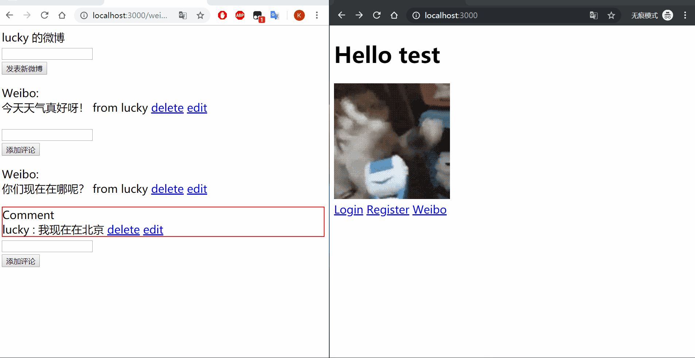
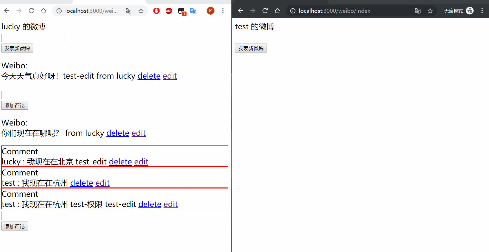
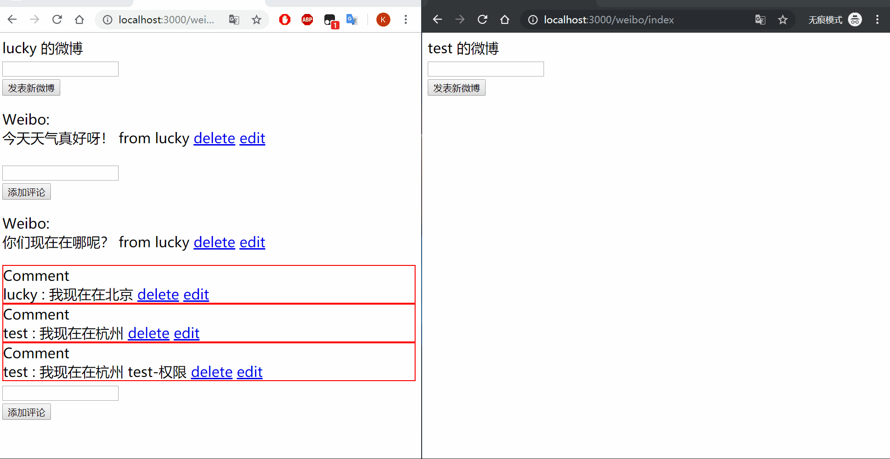

# Web-Server
## 基于 Socket 实现的以 MVC 模式的 HTTP 原生 Web 服务器

# 技术栈
## Python + HTTP + Socket + MySQL + Jinjia2

## MVC
- Model 模型 使用 MySQL 作为数据库，并自制 ORM 对象关系映射对增删改查的 SQL 语句进行封装
- View 视图 使用 Jinja2 模板实现页面的渲染
- Controller 控制器 利用高阶函数对用户权限验证字典实现路由的分发，用装饰器实现权限验证

## Web Server
- 基于 Socket 端口实现了简单的 HTTP 服务器
- 服务器能对客户端的请求进行监听、解析、返回响应
- 使用 Python 多线程实现并发

# 功能展示
- **解析请求**

- **注册**

- **登录**

- **发表微博**

- **微博评论**

- **权限验证**
  - 只允许 登录用户查看 微博和评论
  - 只允许 微博 发布者修改和删除 微博 
  - 只允许 评论 评论者修改和删除 评论

  - **删除**
  

  - **编辑**
  

